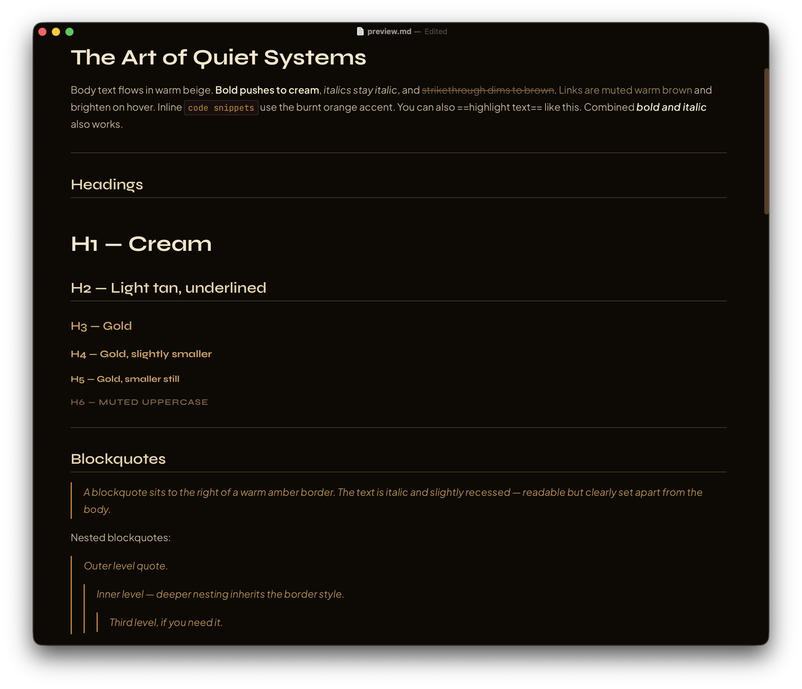

# Salamander — Typora Theme

A warm dark theme for Typora with burnt orange accents, earthy browns, and cream highlights. Designed to match [blog.salamander.mobi](https://blog.salamander.mobi).



## Features

- Warm dark palette — dark brown background, warm beige text, burnt orange accents
- Three bundled font families — works fully offline, no web fonts required
- Full syntax highlighting for code blocks
- Styled tables, math blocks (KaTeX), task lists, and Mermaid diagrams

## Palette

| Role        | Color     |
|-------------|-----------|
| Background  | `#0E0A06` |
| Text        | `#CAB292` |
| H1          | `#F5E6C8` |
| H2          | `#E8D5A9` |
| H3–H5       | `#D6A161` |
| Accent      | `#D6831B` |
| Links       | `#9A7A58` |
| Muted       | `#7D5E3D` |

## Fonts

| Role     | Font               |
|----------|--------------------|
| Headings | Syne 600/700       |
| Body     | Plus Jakarta Sans  |
| Code     | JetBrains Mono     |

## Installation

1. Download the [latest release](https://github.com/mariusw/salamander-typora-theme/releases/latest) zip
2. Unzip and copy `salamander.css` and the `salamander/` folder into your Typora themes directory
   - Open it via **Preferences → Appearance → Open Themes Folder**
3. Restart Typora and select **Salamander** under **Preferences → Appearance → Theme**

## Development

Clone the repo and symlink into your Typora themes directory:

```bash
git clone https://github.com/mariusw/salamander-typora-theme.git
ln -s "$(pwd)/salamander-typora-theme/salamander.css" ~/Library/Application\ Support/abnerworks.Typora/themes/salamander.css
ln -s "$(pwd)/salamander-typora-theme/salamander" ~/Library/Application\ Support/abnerworks.Typora/themes/salamander
```

## License

MIT
